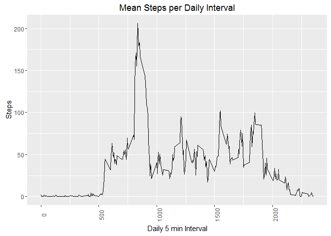

# Reproducible Research: Peer Assessment 1

##Loading packages

```r
library(dplyr)
```

```
## 
## Attaching package: 'dplyr'
```

```
## The following objects are masked from 'package:stats':
## 
##     filter, lag
```

```
## The following objects are masked from 'package:base':
## 
##     intersect, setdiff, setequal, union
```

```r
library(ggplot2)
library(xtable)
```

## Loading and preprocessing the data


```r
if (!"activity.csv" %in% list.files(getwd())) unzip("activity.zip") #unzip file if csv does not exist

data<-read.csv("activity.csv", stringsAsFactors = FALSE) #read in data

data$date<-as.POSIXct(data$date) #change date from string to date variable
```

## What is mean total number of steps taken per day?


```r
#make historgram chart
day_data<-data %>%
  group_by(date) %>%
  summarise(daily_steps=sum(steps)) %>%
  ggplot(aes(x=date,y=daily_steps)) +
  geom_bar(stat='identity') +
  labs(title= "Count of Steps by Day", x="Date", y="Steps") +
  theme(axis.text.x=element_text(angle=45))
```
###Look at histogram


```r
print(day_data)
```


###Report mean and median steps

```r
stats<-data %>%
  group_by(date) %>%
  summarise(daily_steps=sum(steps)) %>%
  ungroup() %>%
  summarise(mean_steps=mean(daily_steps, na.rm=TRUE),median_steps=median(daily_steps, na.rm=TRUE))

print(xtable(stats), type="html", include.rownames=FALSE)
```

<!-- html table generated in R 3.2.1 by xtable 1.8-2 package -->
<!-- Thu Apr 07 09:30:25 2016 -->
<table border=1>
<tr> <th> mean_steps </th> <th> median_steps </th>  </tr>
  <tr> <td align="right"> 10766.19 </td> <td align="right"> 10765 </td> </tr>
   </table>


## What is the average daily activity pattern?

###Let's plot a time series first

```r
data %>%
  group_by(interval) %>%
  summarise(int_steps=mean(steps, na.rm=TRUE)) %>%
  ggplot(aes(x=interval,y=int_steps)) +
  geom_line() +
  labs(title= "Mean Steps per Daily Interval", x="Daily 5 min Interval", y="Steps") +
  theme(axis.text.x=element_text(angle=90))
```



###What is this one really high step interval? Seems to be interval 835

```r
data %>%
  group_by(interval) %>%
  summarise(int_steps=mean(steps, na.rm=TRUE)) %>%
  arrange(desc(int_steps))%>%
  head(1)
```

```
## Source: local data frame [1 x 2]
## 
##   interval int_steps
##      (int)     (dbl)
## 1      835  206.1698
```
  
## Imputing missing values

###How many missing values do we have anyways? Let's look for each variable

```r
apply(data,2,function(x) sum(is.na(x)))
```

```
##    steps     date interval 
##     2304        0        0
```

###We knew from the historgram before that it's probably due to a few days missing all data, but let's check.

```r
data %>%
  group_by(date) %>%
  summarise(na_steps=sum(is.na(steps)))%>%
  ggplot(aes(x=date,y=na_steps))+ geom_bar(stat='identity')+
  labs(title= "Count of Missing Data by Day", x="Date", y="Missing Observations")
```


###Replace missing data with average interval data


```r
#get interval averages
avg_ints<-data %>%
  group_by(interval) %>%
  summarise(int_steps=mean(steps, na.rm=TRUE))

#create copy of data 
new_data<-data

#replace all missing data by interval average
for (row in c(1:nrow(new_data))){
  if (is.na(new_data[row,1])){
    new_data[row,1]<-avg_ints[match(new_data[row,3],avg_ints$interval),2]
  }
}
```

###Look at updated histogram with mean and median steps

```r
#make historgram
new_data %>%
  group_by(date) %>%
  summarise(daily_steps=sum(steps)) %>%
  ggplot(aes(x=date,y=daily_steps)) +
  geom_bar(stat='identity') +
  labs(title= "Count of Steps by Day, Imputed Data", x="Date", y="Steps") +
  theme(axis.text.x=element_text(angle=45))
```


###Compare old and new mean and median values to understand impact of replacing missing data. Imputed data makes for completely normally distributed data. Mean doesn't change because were using mean values to replace NAs.

####Old data (includes missing data)

```r
print(xtable(stats), type="html", include.rownames=FALSE)
```

<!-- html table generated in R 3.2.1 by xtable 1.8-2 package -->
<!-- Thu Apr 07 09:30:28 2016 -->
<table border=1>
<tr> <th> mean_steps </th> <th> median_steps </th>  </tr>
  <tr> <td align="right"> 10766.19 </td> <td align="right"> 10765 </td> </tr>
   </table>

####New data (imputed data)

```r
#imputed data
print(xtable(new_data %>%
  group_by(date) %>%
  summarise(daily_steps=sum(steps)) %>%
  ungroup() %>%
  summarise(mean_steps=mean(daily_steps, na.rm=TRUE),median_steps=median(daily_steps, na.rm=TRUE))),
  type="html",
  include.rownames=FALSE)
```

<!-- html table generated in R 3.2.1 by xtable 1.8-2 package -->
<!-- Thu Apr 07 09:30:28 2016 -->
<table border=1>
<tr> <th> mean_steps </th> <th> median_steps </th>  </tr>
  <tr> <td align="right"> 10766.19 </td> <td align="right"> 10766.19 </td> </tr>
   </table>
## Are there differences in activity patterns between weekdays and weekends?

###Create weekday/weekend variable and graph it

```r
new_data %>%
  mutate(day=factor(ifelse(weekdays(new_data$date) %in% c("Saturday","Sunday"),"Weekend","Weekday")))%>%
  group_by(day, interval)%>%
  summarise(avg=mean(steps))%>%
  ggplot(aes(x=interval,y=avg)) +
  geom_line(colour="blue")+
  facet_wrap(~day)+
  labs(title="Average steps per 5 minute interval",y="Steps",x="Interval")
```


Looks like people have big spike during normal commuting hours in the morning for weekdays, and more even (and start later!) on weekends.
